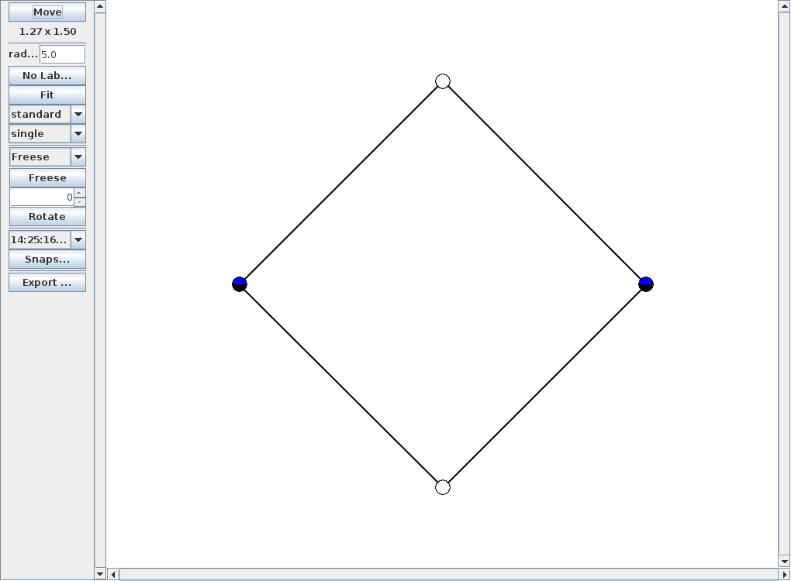

conexp-clj provides a wide range of functionality to compute concepts of formal contexts,
and to display the corresponding concept lattice.  Formal concepts itself are represented
as pairs (vectors) of sets, which corresponds to the original mathematical definition.

# Computing Formal Concepts

To compute the concept of a formal context, we use the `concepts` function

```clj
(concepts (diag-context 4))
;; => ([#{0 1 3 2} #{}] [#{0} #{0}] [#{} #{0 1 3 2}] [#{1} #{1}] [#{3} #{3}] [#{2} #{2}])

(concepts (adiag-context 3))
;; => ([#{0 1} #{}] [#{1} #{0}] [#{} #{0 1}] [#{0} #{1}])
```

(recall that `diag-context` and `adiag-context` compute the nomial and contra-nomial
scale, respectively).  Intents and extends can be obtained from combining `concepts` with
`map` and `first` or `second`, but there are also the convenience functions `extents` and
`intents` which can do the job

```clj
(intents (diag-context 4))
;; => (#{} #{2} #{3} #{1} #{0} #{0 1 3 2})

(map first (concepts (diag-context 4)))
;; => (#{} #{0} #{0 1 3 2} #{1} #{3} #{2})
```

conexp-clj uses Close-by-One to compute the concepts of a formal context, and Next-Closure
to compute the intents and extents as returned by `intents` and `extents`, respectively.

All of `concepts`, `intents`, `extents` return lazy sequences.

`concepts` only returns a sequence of concepts of a formal context, but does not represent
their lattice structure.  For this, one can use `concept-lattice`

```clj
(concept-lattice (adiag-context 4))
;; => Lattice on 16 elements.
```

Interesting function which work on lattice structures are

- `lattice-atoms`
- `lattice-coatoms`
- `lattice-doubly-irreducibles`
- `lattice-inf-irreducibles`
- `lattice-lower-neighbours`
- `lattice-one`
- `lattice-sup-irreducibles`
- `lattice-upper-neighbours`
- `lattice-zero`

Their purpose of these functions is clear from their names, see the corresponding
documentation on further details.

# Displaying Concept Lattices

It has to be noted that conexp-clj treats lattices are objects that are different from
their graphical representation.  To draw concep lattices (or even arbitrary lattices)
conexp-clj provides the notion of *layouts*.  Layouts are essentially mappings from the
elements of a lattice to position in ℝ², together with the information which nodes are
connected and where optional labels should be positioned.  See the corresponding code for
mode information on this.

conexp-clj provides some pre-defined layouts, and more can be defined as needed.
While layouts itself are enabled by default, drawing these layouts must be enabled
explicitly via

```clj
(use 'conexp.contrib.draw)
```

After this, the function `draw-lattice` can be used to display a lattice

```clj
(draw-lattice (concept-lattice (adiag-context 2)))
```

As a result, a window should open which shows the lattice.  In addition, some
functionality is provided that allows to further improve the image manually.



The layout used by `draw-lattice` is defined in `standard-layout`.  Other layouts can be
provided to `draw-lattice` as an additional argument

```clj
(draw-lattice (concept-lattice (adiag-context 2))
              :layout-fn inf-additive-layout)
```

Other interesting functions are `draw-layout`, which implements the drawing of layouts,
and `draw-concept-lattice`, which draws the concept-lattice of a given formal context.
